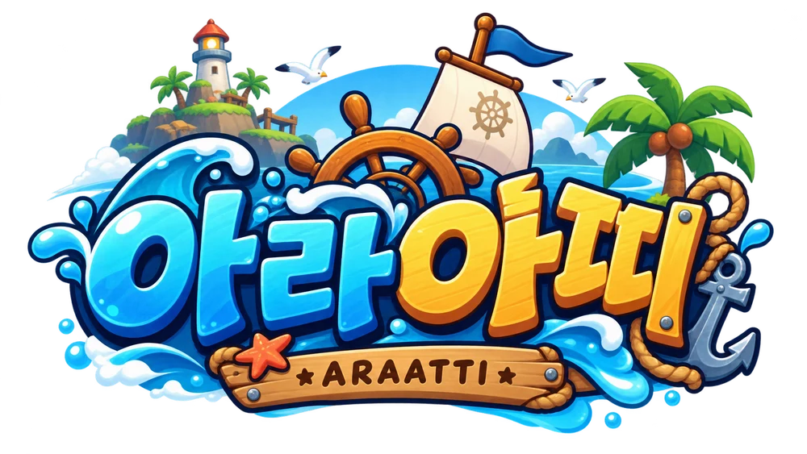
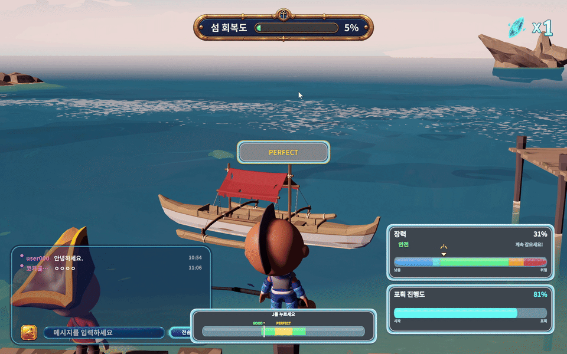
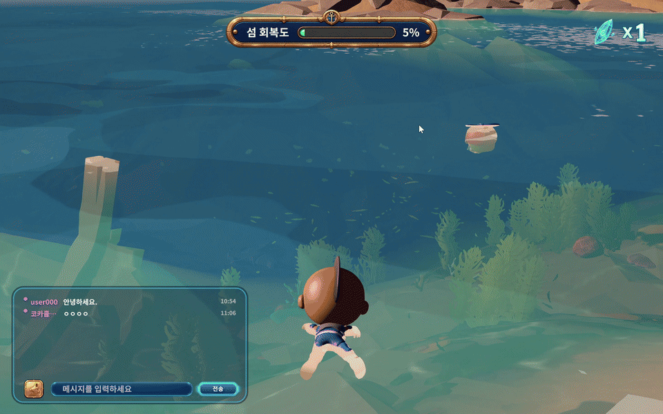
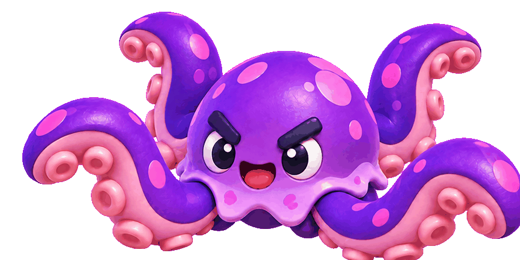
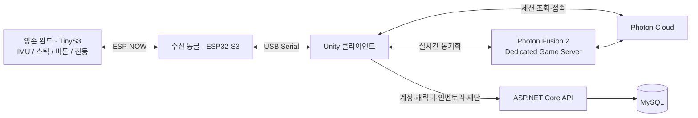

<div align="center">



# 아라아띠 · Araatti

**양손의 움직임으로 함께 되찾는, 바다의 심장**

IoT 완드와 Unity로 만드는 해양 체감형 멀티플레이 게임

[홈페이지 · 게임 다운로드](https://araatti.site) · [최종 발표자료 PDF](docs/presentation.pdf) · [실행 및 배포 가이드](exec/README.md) · [시연 시나리오](exec/04_시연시나리오.md)

SSAFY 15기 · 팀 C101 · 6인 프로젝트

</div>

## 프로젝트 소개

아라아띠는 친구들과 미니게임을 즐기며 **바다의 심장 조각을 모아 섬을 되살리는 게임**입니다. 같은 로비에서 만나 항해와 전투, 광산 복원에 도전하고, 획득한 조각을 제단에 봉헌해 모두가 공유하는 섬 회복도를 높입니다.

양손에 쥐는 무선 IoT 완드는 휘두르기·내리치기·찌르기·기울이기를 게임 속 행동으로 바꾸고, 진동으로 피드백을 전달합니다. **완드 없이도 키보드와 마우스로 플레이할 수 있습니다.**

## 게임 화면


바다를 탐험하고, 친구들과 심장 조각을 모아 섬을 되살립니다. 실제 플레이 캡처를 사용했으며, 위 로비 이미지는 소개용으로 채팅창을 제거한 편집본입니다.

<table>
  <tr>
    <td width="50%" align="center"><br><b>배 협동</b><br>한 배에서 함께 위기에 대응하는 항해</td>
    <td width="50%" align="center"><br><b>광산</b><br>기억한 그림을 차례대로 완성하는 협동 채굴</td>
  </tr>
  <tr>
    <td width="50%" align="center"><br><b>무쌍</b><br>공격 방향을 맞춰 도전하는 크라켄 전투</td>
    <td width="50%" align="center"><br><b>캐릭터 커스터마이징</b><br>얼굴부터 의상까지 나만의 캐릭터 만들기</td>
  </tr>
  <tr>
    <td width="50%" align="center"><br><b>수중 탐험</b><br>물고기 사이로 친구들과 자유롭게 수영</td>
    <td width="50%" align="center"><br><b>함께 즐기는 로비</b><br>제단 앞에 모여 춤추고 소통하는 시간</td>
  </tr>
</table>

## 플레이 시연 · 발표자료

[최종 발표자료 보기 (PDF · 35장)](docs/presentation.pdf)

발표자료의 애니메이션 GIF는 아래에서 별도로 볼 수 있습니다. PDF에는 정지 화면으로 표시됩니다.

| 낚시 | 수영 |
| --- | --- |
|  |  |

<details>
<summary>크라켄 모델링 GIF 보기</summary>

발표자료의 AI 3D 모델링 소개에 사용한 이미지입니다.



</details>

## 주요 콘텐츠

| 콘텐츠 | 플레이 방식 | 핵심 경험 |
| --- | --- | --- |
| 배 협동 | 1~4인 입장, 빈 승무원 자리를 AI 봇으로 보충 | 조타·돛 조절·대포·수리를 나눠 맡아 암초, 파도, 돌풍, 적선과 선체 파손에 대응하는 협동 항해 |
| 광산 | 1~4인 | 목표 그림을 기억하고 차례대로 땅을 파거나 복구해 그림을 완성하는 기억·협동 게임 |
| 무쌍 | 1~2인 | 세 가지 공격으로 적 무리와 크라켄의 촉수를 상대하고, 리듬 액션으로 보스를 마무리하는 전투 |
| 로비 | 여러 플레이어가 함께 사용하는 공간 | 캐릭터 꾸미기, 채팅, 낚시, 수영, 춤, 포탈 이동 |
| 제단 | 전체 플레이어의 공동 목표 | 심장 조각을 봉헌하고 섬 회복도와 완성 연출을 공유 |

게임별 인원은 현재 소스 설정 기준이며, 배포된 클라이언트와 서버의 버전에 따라 다를 수 있습니다.

### 플레이 흐름

```text
회원가입·로그인 → 캐릭터 생성 → 채널 선택 → 로비 탐험
                                              ↓
                              포탈에서 게임·인원 선택 → 매칭
                                              ↓
                                    미니게임 → 보상 획득
                                              ↓
                              로비 복귀 → 제단 봉헌 → 섬 회복
```

## IoT 체감형 조작

플레이어 한 명은 **왼손 완드 1대 + 오른손 완드 1대 + USB 수신 동글 1대**를 사용합니다.

| 입력 | 게임에서의 활용 |
| --- | --- |
| 왼손·오른손 조이스틱 | 캐릭터 이동, 카메라 조작, UI 선택 |
| 가로 휘두르기·내리치기·찌르기 | 무쌍의 공격, 광산 채굴, 배 수리 |
| 양손 기울이기·비틀기 | 배의 조타와 돛 조절 |
| 버튼 | 점프, 달리기, 상호작용, 낚시 등 상황별 행동 |
| 진동 피드백 | 게임에서 발생한 피드백을 완드로 전달 |

완드 펌웨어가 IMU 동작을 판정하고, Unity의 공통 입력 인터페이스를 통해 각 게임이 이를 자기 행동으로 해석합니다. 키보드 입력도 같은 인터페이스를 사용합니다.

자세한 내용: [IoT 하드웨어·펌웨어 가이드](exec/05_IoT완드.md) · [게임별 키 매핑](unity/UnderTheSea/Assets/Game/Scripts/IoT/KEY_MAPPING.md)

## 시스템 구성



- **실시간 게임과 영속 데이터를 분리:** Photon Fusion 전용 서버가 게임 상태를 동기화하고, ASP.NET Core API와 MySQL이 계정·캐릭터·보상·제단 데이터를 관리합니다.
- **로비와 미니게임의 세션 분리:** 로비에서 매칭한 뒤 해당 게임 서버로 이동하고, 게임이 끝나면 로비로 돌아옵니다.
- **서버에서 관리하는 AI 승무원:** 배 협동의 빈자리를 봇으로 채우고, 플레이어 입·퇴장에 따라 봇을 추가하거나 제거합니다.
- **웹과 게임의 배포 분리:** Vite로 빌드한 소개 페이지와 Unity 게임 다운로드 파일을 별도 배포 과정으로 관리합니다.

## 기술 스택

| 영역 | 기술 |
| --- | --- |
| 게임 클라이언트 | Unity **6000.5.9f1**, C#, URP, Input System, uGUI / TextMeshPro |
| 실시간 멀티플레이 | Photon Fusion **2**, Dedicated Server |
| API · 인증 | ASP.NET Core **8**, Entity Framework Core **9**, JWT, BCrypt |
| 데이터베이스 | MySQL **8.4**, Docker Compose |
| IoT | ESP32-S3 / TinyS3, Arduino, ESP-NOW, USB Serial, IMU, DRV2605L |
| 웹 | HTML, CSS, JavaScript, Vite |
| 배포 | AWS EC2, Ubuntu, nginx, Unity Linux Dedicated Server |

## 실행하기

### 게임 플레이

1. [아라아띠 홈페이지](https://araatti.site)에서 Windows용 게임을 다운로드하고 압축을 풉니다.
2. 완드를 사용한다면 게임 실행 전에 수신 동글을 USB에 연결합니다.
3. 압축을 푼 폴더의 **`게임시작.bat`**를 실행합니다. 서버 접속 설정을 전달하므로 실행 파일을 직접 여는 대신 배치 파일을 사용합니다.
4. 회원가입·로그인 후 캐릭터를 만들고 채널에 입장합니다.

온라인 플레이에는 게임 서버와 API가 실행 중이어야 합니다. 서버를 직접 구성하려면 아래 개발 문서를 참고하세요.

### 소스에서 실행

에셋은 Git LFS로 관리합니다. Git LFS를 설치한 환경에서 저장소를 받습니다.

```bash
git lfs install
git clone https://github.com/mimimha/araatti-iot-game.git
cd araatti-iot-game
git lfs pull
```

| 실행 대상 | 시작 방법 | 상세 안내 |
| --- | --- | --- |
| Unity 게임 | Unity Hub에서 `unity/UnderTheSea`를 Unity 6000.5.9f1로 열기 | [빌드·서버 구성·환경 설정](exec/01_포팅매뉴얼.md) |
| API · DB | .NET SDK와 Docker 준비 → 개발용 설정 작성 → DB 실행·마이그레이션 → API 실행 | [서버 개발 가이드](server/README.md) |
| 소개 웹사이트 | `cd web` → `npm install` → `npm run dev` | [웹 개발 가이드](web/README.md) |
| 완드 · 동글 | Arduino 환경에서 각각의 펌웨어 빌드·업로드 | [IoT 포팅 매뉴얼](exec/05_IoT완드.md) |

Unity 프로젝트 폴더의 `UnderTheSea`는 내부 프로젝트명이며, 게임 이름은 **아라아띠**입니다.

## 저장소 구조

```text
araatti-iot-game/
├── unity/UnderTheSea/   # Unity 클라이언트 및 Dedicated Server
├── server/             # ASP.NET Core API, DB 설정 및 테스트
├── firmware/           # 양손 완드와 USB 수신 동글 펌웨어
├── web/                # 게임 소개·다운로드 웹사이트
├── tools/deploy/       # 게임 빌드·패키징·배포 도구
├── docs/               # API 명세, 설계 및 구현 기록
├── exec/               # 포팅 매뉴얼, 외부 서비스, 시연 시나리오
└── art/                # UI 리소스, 디자인 자료 및 캡처
```

## 팀 구성

SSAFY 15기 **C101 · 6명**이 함께 개발했습니다.

| 역할 | 인원 |
| --- | --- |
| Unity 게임 클라이언트 | 3명 |
| 게임 서버 · API | 1명 |
| IoT · 하드웨어 | 2명 |

## 개발 문서

- [게임 구조와 네트워크 흐름](unity/UnderTheSea/GAME_STRUCTURE.md)
- [API 명세](docs/api/api-spec.md)
- [포팅 매뉴얼 전체 목록](exec/README.md)
- [시연 시나리오](exec/04_시연시나리오.md)
- [Unity 개발 컨벤션](unity/UnderTheSea/CONVENTION.md)
- [Git 협업 컨벤션](GIT_CONVENTION.md) — 기존 GitLab 개발 당시의 협업 규칙

## 에셋 · 음악 크레딧

외부 에셋은 각 제공처의 라이선스를 따릅니다. 전체 목록은 [Unity 에셋 목록](unity/UnderTheSea/ASSETS.md)을 참고하세요.

### 배경음악 · 환경음

실제 게임 씬에 연결된 배경음악과 환경음입니다. 타이틀·로비의 두 곡은 Eugene Des의 **Exploration Fantasy Free Pack**에 포함되어 있습니다.

| 사용 구간 | 곡 · 환경음 | 제작자 |
| --- | --- | --- |
| 타이틀 · 로그인 · 캐릭터 생성 · 채널 선택 | The Apothecary — Exploration Fantasy Free Pack | Eugene Des |
| 로비 | The Tavern Keeper — Exploration Fantasy Free Pack | Eugene Des |
| 배 협동 · 대기 | [Set Sail](https://pixabay.com/music/main-title-set-sail-350596/) | Forgotten-Hero-Records |
| 배 협동 · 항해 | [Pirate Tavern (Full Version!)](https://pixabay.com/music/main-title-pirate-tavern-full-version-167990/) | Magiksolo (Artem Hramushkin) |
| 배 협동 · 결과 | [Pirate Adventure Loop](https://pixabay.com/music/orchestral-pirate-adventure-loop-557984/) | Ebunny |
| 광산 · 대기 | [Mystery Secret](https://pixabay.com/music/mystery-mystery-secret-255437/) | leberch |
| 광산 · 본편 | [Old Mine Ambience](https://pixabay.com/sound-effects/film-special-effects-old-mine-ambience-200677/) — 동굴 환경음 | JoelFazhari |
| 무쌍 · 대기 및 1·2라운드 | [Pirate Jolly Roger Loop](https://pixabay.com/music/main-title-pirate-jolly-roger-loop-369969/) | Ebunny |
| 무쌍 · 3라운드 | [Pirates Battle](https://pixabay.com/music/main-title-pirates-battle-361336/) | Ebunny |

Exploration Fantasy Free Pack은 저장소의 에셋 기록상 Unity Asset Store에서 도입했습니다. Pixabay 음원은 [Pixabay Content License](https://pixabay.com/service/license-summary/)를 참고하세요. 개별 도입 기록과 보관된 라이선스 증명서는 아래 문서 및 각 오디오 폴더에 있습니다.

### 효과음 · 상세 출처

| 영역 | 크레딧 문서 |
| --- | --- |
| 배 협동 | [배경음악, 대포·수리·파도·밧줄 효과음](unity/UnderTheSea/Assets/Game/Audio/ShipCoop/CREDITS.md) |
| 광산 | [배경음악·동굴 환경음, 채굴·복구·결과 효과음](unity/UnderTheSea/Assets/Game/Audio/Mine/CREDITS.md) |
| 무쌍 | [배경음악·파도, 전투 효과음 및 팀 제작 사운드](unity/UnderTheSea/Assets/Game/Audio/Warriors/CREDITS.md) |
| 로비 | [수영·잠수 효과음](unity/UnderTheSea/Assets/Game/Audio/Lobby/CREDITS.md) |
| 낚시 | [낚시 효과음 및 외부 에셋](unity/UnderTheSea/Docs/Fishing/ThirdPartyLicenses.md) |
